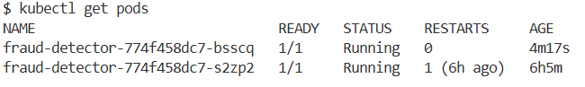
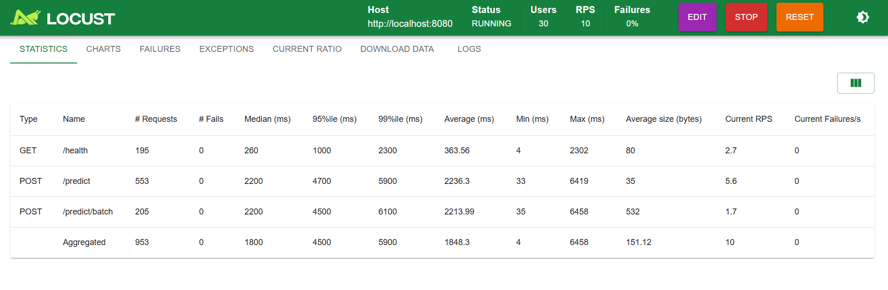
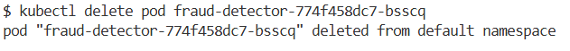
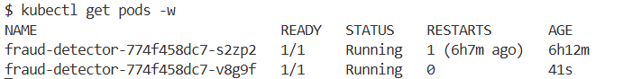
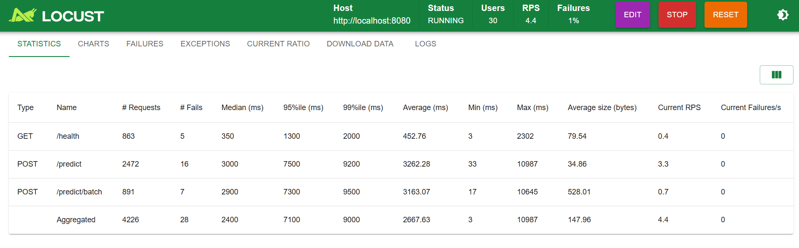

# 🔐 Detecção de Transações Fraudulentas

## 🔍 Sobre o Projeto

O objetivo deste projeto é **construir Modelos de Machine Learning capazes de detectar transações fraudulentas** com a melhor precisão a fim de **minimizar as perdas financeiras** potenciais geradas por fraudes, cobrindo todo o ciclo de vida de um produto de Machine Learning: da exploração dos dados até o deploy em produção com orquestração via Kubernetes.

O projeto foi desenvolvido a partir de uma base de dados em Excel com informações de transações financeiras.

A base de dados do case está disponível no seguinte link: [Preparatório para Entrevistas em Dados (PED)](https://renatabiaggi.com/ped/)

> **Nota:** o arquivo `.xlsx` não está incluído no repositório. Para reproduzir o treinamento, baixe a base pelo link acima. Os testes automatizados utilizam um DataFrame sintético e rodam sem depender do arquivo original.

---

## 🏗️ Arquitetura do Projeto

```
fraude-detector/
├── .github/
│   └── workflows/
│       └── ci.yml                        # CI/CD: testes → build → push Docker Hub
├── notebooks/
│   ├── Fraude - Problema de Classificação Desbalanceada.ipynb  # Experimentação completa
│   └── simulacao.ipynb                   # Simulações e testes exploratórios
├── src/
│   ├── config.py                         # Caminhos, constantes e features centralizados
│   ├── pipeline_fraude.py                # Pipeline completo de ML (treino)
│   ├── predictor.py                      # Classe de inferência (carrega .joblib)
│   ├── simulator.py                      # Geração de dados sintéticos
│   └── api/
│       ├── app.py                        # Instância FastAPI + CORS
│       ├── routes.py                     # Endpoints: /health, /predict, /predict/batch
│       └── schemas.py                    # Contratos Pydantic (entrada e saída)
├── models/
│   └── pipeline_fraude_completo.joblib   # Pipeline treinado serializado
├── tests/
│   ├── conftest.py                       # DataFrame sintético compartilhado
│   ├── test_predictor.py                 # Testes do FraudPredictor
│   └── test_simulator.py                 # Testes do simulador
├── k8s/
│   ├── deployment.yml                    # 2 réplicas, health checks, resource limits
│   ├── service.yml                       # NodePort na porta 30080
│   └── configmap.yml                     # Variáveis de ambiente
├── Dockerfile                            # Multi-stage build (builder + runtime)
├── docker-compose.yml                    # Deploy local simplificado
├── kind-config.yml                       # Cluster Kubernetes local (Kind)
├── locustfile.py                         # Testes de carga (Locust)
├── pyproject.toml                        # Dependências gerenciadas pelo Poetry
└── README.md
```

---

## 🛠️ Stack Tecnológica

**Machine Learning**
- `scikit-learn` — Modelos e métricas
- `xgboost` — Modelo de classificação campeão
- `category-encoders` — CatBoost Encoding
- `feature-engine` — Engenharia de features
- `optuna` — Otimização de hiperparâmetros
- `shap` — Interpretabilidade
- `boruta` — Seleção de features

**API & Serving**
- `FastAPI` — Framework da API REST
- `uvicorn` — Servidor ASGI
- `pydantic` — Validação de schemas
- `joblib` — Serialização do pipeline completo

**MLOps & Infraestrutura**
- `Docker` — Containerização com multi-stage build
- `Kubernetes` (Kind) — Orquestração local com auto-healing e rolling updates
- `GitHub Actions` — CI/CD automatizado
- `pytest` — 35 testes automatizados
- `Locust` — Testes de carga

---

## 📁 Como Rodar o Projeto

### Pré-requisitos
- Python 3.12
- Poetry
- Docker Desktop
- Kind + kubectl (para Kubernetes)

### Instalação

```bash
# Clonar o repositório
git clone https://github.com/mateuscoffran/fraude_classificacao.git
cd fraude_classificacao

# Instalar dependências
poetry install

# Ativar ambiente virtual
source .venv/Scripts/activate  # Windows
source .venv/bin/activate       # Linux/Mac
```

---

## 📊 Metodologia de Machine Learning

### Abordagem de Desenvolvimento
O projeto seguiu uma metodologia iterativa em ciclos, permitindo:
- Avaliação incremental do impacto de cada transformação
- Validação contínua da performance
- Entregas de valor progressivas

### Etapas Implementadas

#### 1️⃣ Preparação dos Dados
- Análise de desbalanceamento das classes
- Detecção e tratamento de dados faltantes

#### 2️⃣ Engenharia de Features
- **Encoding categórico:** Target Encoding e CatBoostEncoder
- **Imputação robusta:** KNN Imputer (5 vizinhos, pesos por distância)
- **Features temporais:** Extração e transformação cíclica (seno/cosseno)
- **Discretização:** K-Means Discretizer com número ótimo de bins por coluna (silhouette score) e Decision Tree Discretizer
- **Features polinomiais:** Interações de grau 2 entre features contínuas relevantes
- **Padronização:** StandardScaler e RobustScaler
- **Seleção de features:** Método Boruta → 47 features selecionadas

#### 3️⃣ Modelagem
Foram treinados e avaliados **8 modelos** de diferentes famílias:

| Modelo | Tipo |
|--------|------|
| Regressão Logística | Linear |
| SVM | Linear |
| Árvore de Decisão | Tree-based |
| Random Forest | Ensemble (Bagging) |
| CatBoost | Gradient Boosting |
| LightGBM | Gradient Boosting |
| XGBoost | Gradient Boosting |
| Rede Neural Artificial | Deep Learning |

#### 4️⃣ Otimização
- **Tunagem de Hiperparâmetros:** Optuna (Bayesian Optimization)
- **Ajuste de Threshold:** TunedThresholdClassifierCV
- **Tratamento de desbalanceamento:** `class_weight='balanced'`

---

## 📈 Métricas de Avaliação

### 🎯 Métrica Principal: F2-Score

```
F2-Score = (1 + β²) × (Precision × Recall) / (β² × Precision + Recall)
onde β = 2 (β² = 4)
```

**Justificativa:** No contexto de fraude, o custo de uma fraude não detectada (Falso Negativo) é significativamente superior ao custo de investigar uma transação legítima (Falso Positivo). O F2-Score dá **4x mais peso ao Recall**, priorizando a captura de fraudes sem ignorar completamente a Precision.

### Métricas Monitoradas
- Recall, Precision, F1-Score, **F2-Score**, ROC-AUC, Acurácia, Matriz de Confusão

---

## 🏆 Resultados do Modelo

Após Engenharia de Features, seleção via Boruta, otimização com Optuna e ajuste de threshold, o modelo com **melhor desempenho** foi o **XGBoost**.

### 🧠 Interpretabilidade (SHAP)

Utilizando **SHAP (SHapley Additive exPlanations)**, foram identificadas as features mais importantes para a detecção de fraudes:
1. `doc_2_vazio²`
2. `categoria_produto`
3. `score_9`

---

## 🚀 Pipeline de Produção

Todo o pré-processamento e o modelo estão empacotados em um único arquivo `.joblib`. Em inferência, o pipeline recebe os dados brutos (igual ao Excel original) e entrega a predição — sem nenhuma transformação manual necessária.

```python
import joblib
pipeline = joblib.load("models/pipeline_fraude_completo.joblib")
y_pred  = pipeline.predict(df_raw)
y_proba = pipeline.predict_proba(df_raw)[:, 1]
```

---

## 🌐 API REST (FastAPI)

O modelo é servido via **FastAPI** com 3 endpoints:

| Método | Endpoint | Descrição |
|--------|----------|-----------|
| GET | `/health` | Status do serviço e metadados do modelo |
| POST | `/predict` | Predição para uma única transação |
| POST | `/predict/batch` | Predição para um lote de transações |

### Documentação interativa
Disponível em `http://localhost:8000/docs` (Swagger UI) após subir a API.

---

## ✅ Testes Automatizados

35 testes organizados em 2 arquivos, cobrindo carregamento do pipeline, contratos de saída, regras de negócio e robustez a inputs inválidos.

```bash
# Rodar todos os testes
pytest

# Com cobertura
pytest --cov=src
```

Os testes utilizam um DataFrame sintético que imita a estrutura do dado real — sem depender do arquivo `.xlsx` original. Isso garante que os testes rodem em qualquer ambiente, inclusive no CI/CD.

---

## 🐳 Deploy com Docker

Para facilitar o deploy local da API, o projeto conta com um ambiente containerizado via Docker. Com isso, é possível executar a aplicação em qualquer máquina com Docker instalado, sem necessidade de configurar o ambiente manualmente.

### 🔧 Construir a imagem

```bash
docker build -t fraud-detector .
```

### 🚀 Rodar a API

```bash
docker run -p 8000:8000 fraud-detector
```

### 🐙 Via Docker Compose (recomendado)

```bash
docker compose up
```

Após iniciar o container, acesse a documentação interativa da API:

```
http://localhost:8000/docs
```

---

## ☸️ Deploy com Kubernetes (Kind)

O projeto inclui manifestos Kubernetes prontos para produção:

- **Deployment:** 2 réplicas com RollingUpdate (zero downtime)
- **Service:** NodePort expondo a API externamente
- **ConfigMap:** Variáveis de ambiente desacopladas do código
- **Health checks:** `livenessProbe` e `readinessProbe` configurados
- **Resource limits:** Requests de `100m` CPU / `256Mi` RAM e limits de `500m` CPU / `768Mi` RAM por Pod

### Health Checks

O Deployment utiliza dois tipos de health check com propósitos distintos:

- **`livenessProbe`** — verifica se o container está vivo. Se falhar, o Kubernetes reinicia o Pod automaticamente.
- **`readinessProbe`** — verifica se o Pod está pronto para receber tráfego. Se falhar, remove o Pod do balanceador sem reiniciá-lo. Especialmente útil durante o startup, quando o modelo XGBoost está sendo carregado na memória.

### Criando o cluster local

```bash
kind create cluster --name fraud-detector --config kind-config.yml
```

### Aplicando os manifestos

```bash
kubectl apply -f k8s/configmap.yml
kubectl apply -f k8s/deployment.yml
kubectl apply -f k8s/service.yml
```

### Verificando o deploy

```bash
kubectl get pods
kubectl get services
curl http://localhost:8080/health
```

---

## 🧪 Testes de Carga e Resiliência

Os testes foram executados com **Locust** simulando usuários reais chamando os endpoints `/predict`, `/predict/batch` e `/health`.

### ⚠️ Nota sobre ambiente local

Os testes de carga foram realizados em ambiente local (Kind + WSL2) com recursos limitados (16GB RAM, ~4GB disponíveis). Nesse contexto, o overhead do cluster Kind compete diretamente com os Pods pelos mesmos recursos físicos, o que impede uma comparação justa de throughput entre a instância única e o Kubernetes local.

Em produção com nós dedicados (ex: GKE, EKS, AKS), as 2 réplicas do Deployment distribuiriam a carga de forma efetiva, demonstrando ganho real de throughput e resiliência.

### 🔁 Auto-healing — O valor real do Kubernetes

O principal benefício do Kubernetes demonstrado neste ambiente é o **auto-healing**: a capacidade de detectar falhas e recuperar o serviço automaticamente, sem intervenção humana.

**Roteiro do teste:**

**1. Estado inicial — 2 Pods saudáveis, 0% de falhas**




**2. Falha simulada — Pod deletado manualmente**

```bash
kubectl delete pod <nome-do-pod>
```



**3. Auto-healing — Kubernetes sobe novo Pod em 41 segundos**



**4. Recuperação — Sistema volta ao normal automaticamente**



### Resultado do Auto-healing

| Situação | Instância única | Kubernetes (2 réplicas) |
|----------|----------------|------------------------|
| Pod/processo falha | ❌ Serviço fora do ar até intervenção manual | ✅ Novo Pod sobe em ~41 segundos |
| Impacto no tráfego | ❌ 100% das requisições falham | ⚠️ Falhas momentâneas durante a substituição |
| Recuperação | ❌ Manual | ✅ Automática |
| `Current Failures/s` após recuperação | — | **0** |

---

## 🔄 CI/CD com GitHub Actions

A cada push na branch `main`, o pipeline de CI/CD automatiza:
1. **Testes automatizados** — roda os 35 testes com `pytest`
2. **Build da imagem Docker** (somente se os testes passarem)
3. **Push para o Docker Hub** (`mateuscoffran/fraud-detector:latest`)

---

## 🧰 Como Rodar os Testes de Carga

```bash
# Instalar Locust
pip install locust

# Sem Kubernetes (docker compose rodando)
locust -f locustfile.py --host=http://localhost:8000

# Com Kubernetes (cluster Kind rodando)
locust -f locustfile.py --host=http://localhost:8080

# Acessar interface web
http://localhost:8089
```
